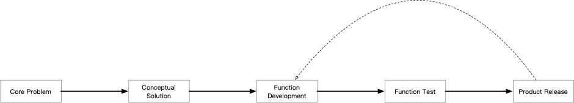
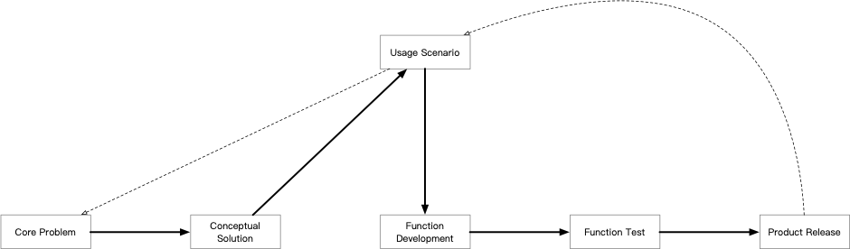
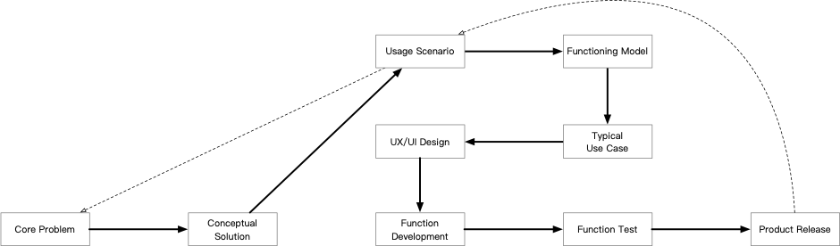
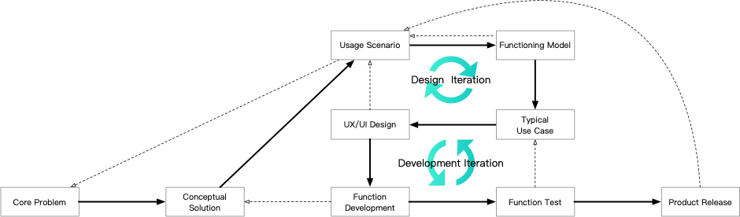

Now we know that a good product is to solve real problems. However, to build a product from scratch is much more than identifying the problem and figuring out a solution.

Think about it. Assuming that you have identified a problem which is valuable to solve, and luckily you figure out a promising solution that should be able to solve the problem in a profitable way. What’s next? A straightforward thought is to start the development, test the product and then release it. Will this work? Unlikely, or you may say “certainly not” if you have had similar experience.

Yes, we have been talking about constant improvement, to try out. Then the question is, what to try next after failed? If we just make some random change and start over in development, hardly can we really make some difference, along with tremendous waste in efforts, resources and time. Even when we are really lucky and get some success for once, it is unlikely to repeat.

Now we get into some real thoughts. In the lean startup scene, Eric Ries talks about validated learning for similar situations, and highlights the goal as well as the metric representing it. As a result, instead of trying out randomly and circling around, the lean startup methodology sets up the iteration, and will finally reach the goal.

With the lean startup methodology in mind, we know that our ultimate goal is to solve the core problem(s), by making the conceptual solution a reality. Okay, what is the metric? How can we tell that our product really solve the problem(s)?

The answer is usage scenario. If we can specify some usage scenarios in which customers are struggling with the problem, and our product can solve it accordingly, we shall be able to say that we reach the goal. Meanwhile, crafting the usage scenarios can help us better understand the core problem in real word, further validate its value, and even correct some misconception to the problem.

The following questions are what the product is like and how target users work with it.

The first step is to get the functioning model of our product/solution, which is to clarify, analyze and conclude which elements are involved in those usage scenarios and how they interact with each other. To avoid being distracted and focus on the core, it is necessary for us to take a certain level of abstraction and generalization when defining elements in each usage scenario.

Based on the functioning model, we can further draw some typical use cases. In each use case, we specify the role and perspective of our target user, the goal she has, and actions we propose for her to do. With those use cases, we can specifically tell how our product is going to work and solve problems our target users have.

Now is the time to answer questions we listed above, what the product is like and how target users work with it. The UX/UI design starts with reviewing and prioritizing use cases we have, and then create a solution that can serve our target user in each use case reasonably well. As you can imagine, the interests of target users in different use cases may conflict, and our design shall serve them with different priority.

Finally we have everything sorted out. However, it is important to acknowledge that we may have made mistakes, with misconceptions or ignoring something important; at the same time, the world we are living in is constantly changing, and what we now believe is right may no longer stand tomorrow. With these in mind, we shall actively rethink the questions after getting answers, verify the thoughts and conclusions with new inputs, and make changes accordingly. Some major points we shall pay special attention are:

- Rethink the usage scenarios after getting the functioning model;
- Put the UX/UI design back to the usage scenarios;
- Examine the conceptual solution when doing function development;
- Verify typical use cases when going through function test

Interestingly, in the whole picture we now get two circles, or “iterations” which is better in telling what we really do, and they are exactly aligned with the two phases of product building: design and development.

Introducing Usage Scenario, Design Iteration and Development Iteration to the process of product building helps to sort out critical information, rationalize and verify opinions, and proceed in a pragmatic way. Happy building!
