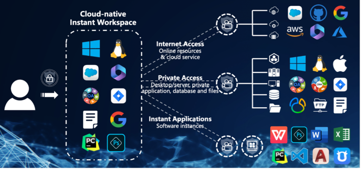
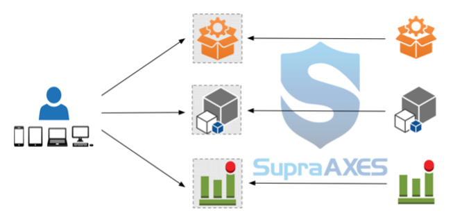
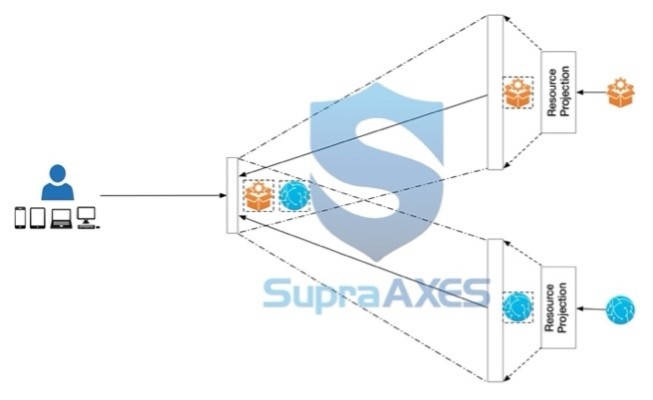
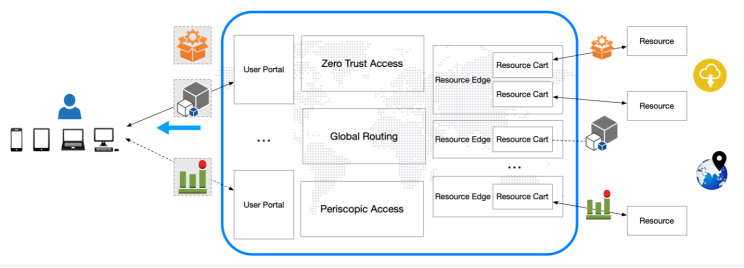

## Introduction

Cloud computing has profoundly reshaped enterprise IT. By adopting different kinds of cloud services, enterprises are now enjoying almost unlimited flexibility and scalability, and can roll out new businesses in speed that could have never imagined. However, just as those names suggest, X-as-a-Service, cloud computing has so far mostly been on the server side, even though more than half of IT budgets and efforts are spent on the client side to empower users working with diverse endpoints.

On the client side, Personal Computer (PC) is at the core, along with latest endpoint variants such as smart phone and tablet. To ensure employees, as well as guests and users from any third-party organization, get reliable, secure, and up-to-date technology to support their work and productivity, enterprise IT usually allocates a large amount of budget and day-to-day efforts to PCs and other endpoint devices on hardware, software, infrastructure, and security.

In the upcoming sections, we will first review what issues are associated with PC, what existing solutions are, and what challenges persist. Then, we will explore what cloud-native instant workspace is, how it introduces cloud computing to the client side, and what advantages it promotes.

## Issues Encountered with Personal Computer

There are various issues with PCs on hardware. It remains relatively expensive to purchase and replace PCs, and physical damage or theft present significant problems. While incompatible components are always challenging, even users with the latest models may soon find their PC devices struggling to handle modern applications that demand more resources or new hardware to, for example, enable new AI features.

On the software side, PC presents its own set of challenges to enterprise IT. Software provisioning and license management involve tasks such as installing software, performing updates, and managing licenses. Each can be time-consuming and complex, and even worse is the fact that enterprise IT cannot access or carry out such work on many of those user devices. Further challenges include ensuring compliance with usage restrictions and preventing unauthorized access, while “Shadow IT”, the fact that users install and use unapproved software, adds another layer of complexity to the situation.

Also, software bloat is always along with the usage of PC. Over time, PCs can accumulate redundant or unnecessary applications, resulting in decreased storage space and impaired system performance. Users may find it challenging to uninstall or manage these applications effectively, and with slower startup and response time it results in decreased productivity and frustrated users.

Another common issue is the need for regular updates. Operating systems, applications, and security solutions often release updates to address bugs, vulnerabilities, and compatibility issues. Due to inadequate resources and time, as well as concerns over interruptions or compatibility problems, it is almost an impossible mission to always keep all user devices up to date. However, ignoring or delaying those updates will not only limit access to new features and enhanced performance, but also leave PCs exposed to different kinds of threats, some of which may lead to catastrophic consequence.

In addition to challenges related to hardware and software, special attentions shall be paid to those with network settings. To access resources in the local network, remote locations and the cloud, users with PCs must have sufficient knowledge to the network and be familiar with settings and configurations to office networks, public Wi-Fi, or VPNs. Most users are not IT professionals, and it has never been easy for them to establish connections to the local network or access resources securely while working remotely, and IT team on the other hand must always be ready to provide proper support.

Security has always been a major concern with PC. Organizations need to address a long list of threats: malware and viruses, social engineering and phishing attacks, weak passwords and authentication, software vulnerabilities, insider threats, and data security, just to name a few. Also, since most, if not all, security incidents arise from unnecessary exposure, it is crucial to be aware of the security risks associated with connecting users to different networks. However, even with various security solutions deployed, organizations have been persistently and fearfully driven by the challenge of effective administration, the evolving nature of threats, the presence of zero-day vulnerabilities, the inevitability of human mistakes, the complexity of securing data across multiple devices and networks, etc.

Moreover, auditing and conducting forensics on PCs are difficult. While compliance with data protection regulations and obtaining appropriate consent are necessary, it has never been easy to establish physical access and chain of custody, especially in remote or distributed work environments. Also, data stored on PCs is volatile and ephemeral, and it requires expertise as well as specialized techniques and tools to capture data and conduct investigations. Furthermore, with the increasing popularity of Bring-Your-Own-Device (BYOD) policy, which no doubt embraces a diversity of operating systems and software, privacy and legal considerations can further hinder the process, if not making it impossible.

## Current Solutions and Their Limitations

Desktop-as-a-Service (DaaS) is a major initiative to embrace cloud computing on the client side. By hosting a virtual desktop instance with a virtual machine in the cloud, DaaS enables a user to work seamlessly on any devices from any place, helps to save on expensive hardware purchase, setup and maintenance, and allows organizations to easily scale up or down on-demand. There is no longer hardware related issue to worry about, and centralized hosting in the cloud makes endpoint management much easier.

DaaS improves security. With DaaS, no data is stored locally on user devices, thus it fundamentally reduces the risk of data loss or theft. When a user device fails or is compromised, the data remains secure and accessible from other devices. If an organization further takes advantage of backup features in the cloud, which is much easier to enable and manage than those for physical devices, virtual desktop instances can be quickly restored in the event of a failure or disaster, helping the organization to minimize downtime and ensure business continuity.

But DaaS instances are still endpoints, and just like physical devices, issues on software, network and administration persist with a DaaS solution. To address those issues, there have been continuous efforts and initiatives from various vendors, and most of them are now taking advantage of cloud computing on the server side. Mostly, Endpoint Management and Security solutions introduce centralized control, simplify administration, and enhance security; Zero Trust Access Control (ZTNA) solutions enforce strict identity verification and grant access on a per-session basis, to minimize the attack surface and simplify access control; Secure Access Service Edge (SASE) combines network security and Wide Area Networking (WAN), to offers a comprehensive security framework with a unified cloud-native architecture.

Nevertheless, despite the availability of these solutions, ensuring administrative efficacy remains an elusive goal for most organizations. IT administrators need to have the knowledge and expertise to deploy, configure, and troubleshoot these solutions effectively, and the complexity will be further amplified when integrating with existing IT infrastructure, such as networking, authentication systems, and cloud services. Furthermore, ongoing monitoring and maintenance is required to ensure effectiveness and security, which is very challenging, especially in dynamic environments and with BYOD policy.

Also, security is far from sufficient as the threat landscape evolves constantly. Vulnerabilities as well as insider threats on persistent endpoints are unavoidable and can be quietly exploited, lateral penetration from a compromised endpoint can be very challenging to notice and prevent, and due to the complexity to effectively integrate all security measures, enough number of professionals with expertise and experience are required but often absent with tight budget.

More importantly, with those solutions there are some major challenges that could never be properly handled. It starts with the need to install and manage a software agent on each endpoint. While users are naturally hostile to such agent software, especially on personal devices, for concerns in resource consumption, system stability, and personal privacy, etc., IT administrators must ensure that on each endpoint the agent software is correctly installed, timely updated, and always compatible with the operating system and other software. Each task is time-consuming and resource-intensive.

Software provisioning has always been very challenging. Tremendous efforts are required to ensure that the software is compatible with the operating system, hardware and existing software on each device/instance, and that licensing is carefully managed to ensure compliance with corresponding contracts or agreements. To deal with “Shadow IT” and enhance supply chain security, it is vital to implement policies and procedures that promote visibility, control, and accountability over software procurement, to monitor software dependencies and conduct vulnerability assessments, and to deploy monitoring solutions that track software usage and activities on both endpoints and the network.

Besides of the complexity in configuration and usage for users, network connections for endpoints are difficult to manage. Configuration conflicts and interoperability issues with diverse software and hardware endpoints are common. Access control to Local Area Network (LAN) requires handling multiple devices and network segments, each with their own unique connectivity and security configuration. Secure remote access through Virtual Private Networks (VPN) or ZTNA requires organizations to deploy and manage gateways, configure authentication methods and user permissions, and more and more.

## Cloud-native Instant Workspace

With current solutions such as DaaS, Endpoint Management and Security, ZTNA, SASE each has its own merits and can supplement each other, we can anticipate the convergence and see the real future of cloud computing on the client side: cloud-native instant workspace. Transcending PC in workplace, the cloud-native instant workspace ensures that employees, contractors, or users from third-parties can seamlessly and securely work with any device, at any time and from any location.

For a legitimate user with browser, a dedicated workspace will be instantly assembled after sufficient authentication, no matter she is with her desktop in the office, a personal MacBook at home, a shared Windows desktop in the business center of a hotel, or a VR gaggle on a Caribbean beach. And with her identity, role, status, and behavioral context verified, all resources for work will be listed there and readily available with just-enough privilege.

On one click, the user’s access to any resource is both simple and secure. She can get Internet Access for a web page or any cloud service, without knowing its URL or the account and password; she can have Private Access to anything in some organization’s private network, e.g. an internal application, a desktop or workstation, or a folder in some file server, with little knowledge about where it is located and how to connect to it; and she can even use some desktop software just as she does with a PC, without doing any installation or configuration. All accesses are granted on a per-session base, through live streams and without sending any raw data, and all requests and activities are with detailed logs and, if required, full records.

When the user leaves, her workspace will vanish immediately. There will be no data or footprint left on the user’s device or any endpoint.

## How the Cloud-native Instant Workspace Works

The cornerstone of cloud-native instant workspace is a patented technology named Resource Projection. Rather than to connect users with resources for work and enforce security check, Resource Projection brings the live-stream projection of a resource’s graphical or textual user interface to the user. With Resource Projection, a user can interact with a resource across the globe just as it is local, while administrators can now enforce all kinds of controls and security checks without touching the user’s endpoint device. Also, since what the user interacts with is the projection of the resource, she will not be able to collect specific information or raw data from the resource, and, for a malicious user, neither could her launch attacks as usual. Of course, if there is malicious content in a target resource, it cannot do harm to any user, either. Moreover, with Resource Projection, all user activities on the resource can be logged, recorded, and replayed at later time for auditing, reference, or forensics.

Upon Resource Projection, another patented technology named Periscopic Access orchestrates users to access resources by three stages and in a periscopic manner. As a result, Periscopic Access enables a user to work with any resource that she cannot reach directly, and at the same time, it provides another layer of shield for the resource, preventing information collecting as well as various attacks. Also, Periscopic Access facilitates a user to access all resources from a single portal and makes it possible to build a service mesh with unparallel scalability, flexibility, and reliability on distributed clouds.

To implement Resource Projection and Periscopic Access for the real world, we have built a solution of distributed clouds with User Portals and Resource Edges.

A User Portal is where users get on board to the Cloud-native Instant Workspace. Verifying a user’s identity with strong authentication, User Portal is also where dynamic access control policies are enforced. In the Cloud-native Instant Workspace, a user will only get a list of resources available for her at the moment, and very limited information about each resource, such as name, icon, and group name, will be available to her. When she requests to access some resource, her request will be double checked according to a set of dynamic access control policies, and, if allowed, passed to the Resource Edge hosting the requested resource for a one-time access session. Specifically, user requests passed to Resource Edges will always be anonymously tokenized, and this makes User Portal an ideal place to enforce regulations and compliances on user identity, e.g. GDPR, as all information regarding to a user’s identity will be confined in the User Portal she connects to. At the same time, there will be no privacy concern since all actions the user takes through a User Portal are for work.

A Resource Edge is the host for a set of resources, and it delivers Periscopic Access sessions on requests from User Portals. While functioning as a broker to retrieve resources from the local network or any accessible address, a Resource Edge can also be a provider to offer a wide range of resources. Inside the Resource Edge, each user request will be handled by a Resource Cart, which will fetch and present the requested resource accordingly. For example, just like in a Remote Browser Isolation (RBI) solution, Resource Cart for a request to a Web resource will setup a purpose-built browser instance. Resource Projection is carried out around the Resource Cart, and while the user interface of the requested resource is projected and streamed to the User Portal accordingly, all raw data from the resource will always stay in the Resource Cart. This makes Resource Edge the clear boundary for data security when enforcing protections according to various regulations and compliances. Moreover, Resource Carts are customized for different resources, and can implement more advanced functions such as Privileged Access Management (PAM) and content filtering.

Specifically, resources provided by a Resource Edge are served as on-demand instances, which are orchestrated with patented technologies as Instant Applications. An Instant Application can be a desktop software, mobile app, or even a properly configured and managed virtual desktop, and Instant Applications on different operating systems can be served to a user at the same time. Each time a user requests to use an Instant Application, an instance will be created from a corresponding template and run with proper settings; when the user leaves, the instance can be immediately terminated and released or kept running for later access. There is also a persistent storage sub-system, which is also for managed sharing among different resources or users, so that a user can retrieve her customization and context from a previous working session, while an administrator therefor can prepare data and files for users to work with.

We see a great potential on Instant Application for cloud computing on client side. On the one hand, Instant Application puts an end to endpoint management. While all kinds of software and apps are always readily available to a user with any device, there is no longer a persistent endpoint as the host, so that administrators will be free from software installation and configuration on user endpoints, will not be bothered by endless upgrades as well as compatibility issues, and will be more assured on software supply chain management. On the other hand, Instant Application is a resilient solution to all kinds of threats from a security perspective. Each instance is with an instant and isolated environment and is generated from a template prepared by the administrator. When a user works with a software or app, she cannot manipulate the underlying runtime environment; moreover, even with the same resource, the user can always get a new and immutable instance to work with, thus makes persistent attacks and lateral penetrations very difficult, if even possible. Furthermore, taking advantage of Instant Applications and the persistent storage mechanism, we manage to separate application programs from persistent data. This implementation, akin to the Harvard Architecture, enhances the overall security posture and results in a significantly reduced threat landscape.

With multiple User Portals and Resource Edges distributed in large scale, the cloud-native instant workspace enjoys an architecture of distributed cloud. To facilitate a user’s access to a resource, Periscopic Access is implemented by a User Portal and a Resource Edge. In a distributed cloud with User Portals and Resource Edges, onboarding a user, who may be an employee in an office, a contractor from home or a roaming client from a partner, encompasses the same underlying logic and procedural considerations as acquiring a new resource, which could be a device, appliance, desktop, software, application, service, etc. While making the whole system more robust and conducting granular permission management to administrators, the autonomy of each User Portal and Resource Edge also promotes the principal of Separation of Duties (SOD).

There can be one or more User Portals and Resource Edges each deployed somewhere on-prem or in cloud with different venders. Each as an edge service built with cloud-native technologies, a User Portal or Resource Edge can be elastically scaled up or down with high availability, while in a minimum deployment the whole system can be hosted by a single server or virtual machine.

Significantly, besides of deployment in the cloud, it is vital to promote cloud computing on the client side with on-prem Resource Edges. Due to various factors such as legacy infrastructure, privacy and compliance, administrator practices, and cost control, there will always be on-prem resources that organizations rely on. By deploying Resource Edges within the local network and connecting them with User Portals in the cloud, organizations will immediately enjoy cloudification to all on-prem resources and enable users all over the globe to access them. At the same time, organizations can enforce comprehensive protection, and get visibility and control that can never be achieved before.

Meanwhile, the option of on-prem User Portals is also important. Most organizations still have employees situated in different physical offices, each with their own set of resources on the local network. While it is inefficient to route all user traffic through the public internet and then back for local resources, requirements for availability and reliability on the client side are diverse and typically less demanding than those on the server side with public cloud. Therefore, the option of on-prem deployment for User Portal and Resource Edge will greatly improve the user experience at a significantly lower cost.

## Advantages with Cloud Computing on the Client Side

With DaaS taking the first step toward client-side cloud computing, we can now embrace a complete solution with cloud-native instant workspace, and organizations with cloud-native instant workspace will enjoy unprecedent advantages:

- **Liberation from Endpoints Usage and Management** The burden with endpoints no longer exists for both users and administrators. Users are now liberated from software installation and updates, stay away from the hassle of dealing with compatibility or configuration issues, and can handle resource-intensive tasks without being hindered by limitations of processing power or memory. Meanwhile, administrators no longer need to worry about device registration or replacement. They are free from configuring or troubleshooting issues with hardware, software and network, and can relax from dealing with all kinds of threats on endpoints, such as malware infections, unauthorized access or data breaches.

- **Easy Access to Unlimited Resources** Users can enjoy effortless access to resources for work without any limitations. Regardless of their location or type, all resources are conveniently consolidated within a single portal and users can seamlessly tap into any one they need. Users are freed from the constraints of physical or network locations, no need to do intricate networking setups, and can take advantage of software or utilities on different operating system or platform at the same time.

- **Versatile Management and Comprehensive Security** Organizations can agilely and effectively manage a diverse range of users at work and enforce sufficient protection to all resources. Taking advantage of granular permission management to administrators and dynamic policy enforcement with attribute-based access control (ABAC) to users, organizations can adjust to changing business needs, accommodate various workflows, and integrate with different software or tools. At the same time, users can only access what is necessary for their work in authorized sessions and with just-enough privilege, and resources will always be shielded from direct access. Such cutting-edge isolation and shielding mechanisms will not only minimize the exposure of all resources and the underlaying infrastructure, defend against up-to-date attacks, mitigate potential risks from persistent threats, but also completely avoid raw data from any resource reaching user endpoint devices and make data breach very difficult, if not impossible. Additionally, detailed logs on user activities, as well as screen records when required, enable efficient auditing and forensic analysis, and enhance overall security protocols.

- **Effortless Infrastructure Management** IT department is fundamentally relieved from the complexities of infrastructure management and gone are the days of struggling with technical complexities. Organizations can easily manage users, resources, and policies to ensure users get uninterrupted access to necessary resources while providing adequate protection for digital assets. Meanwhile, with all resources readily available, there is no need for users to possess extensive knowledge about enterprise infrastructure, so that they can fully concentrate on productivity without being bothered by annoying connectivity issues.

While promoting cloud computing on the client side, cloud-native instant workspace will further encourage the convergence of cloud computing on both the server side and the client side to a cloud-native world. As we are currently talking about “from the cloud” and “to the cloud”, the future is all “in the cloud”.
